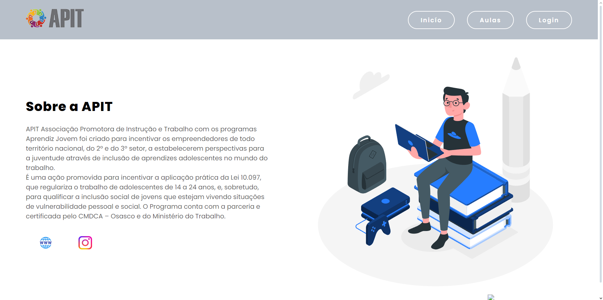
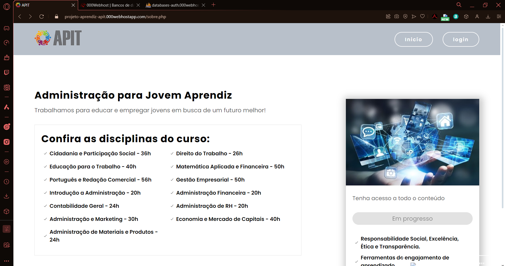
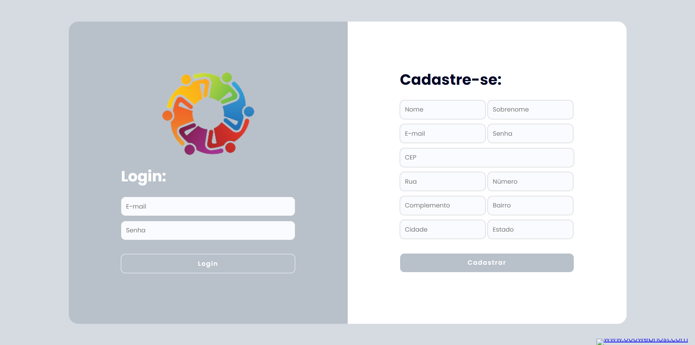

# APIT
  
## Sobre o projeto

Projeto de plataforma com video aulas para jovens aprendizes.

Segue link para deploy: https://projeto-aprendiz-apit.000webhostapp.com

## Layout web

# Tecnologias utilizadas
## Back end
- PHP / MySQL
## Front end
- HTML / CSS / JS

## Autores

Lucas dos Santos Souza
RA: 923104155

Michele da Silva
RA: 923204667

Guilherme Marlon Brito do Carmo 
RA: 923112659

Filipe Pires Amaral
RA: 923115019

Pedro Henrique França Dos Santos
RA: 923107776

Paulo Henrique Bonfim Pereira
RA: 923111378

## Youtube

Segue link de apresentação com vídeo no youtube:
https://www.youtube.com/watch?v=3QXeN6Fhp-E
